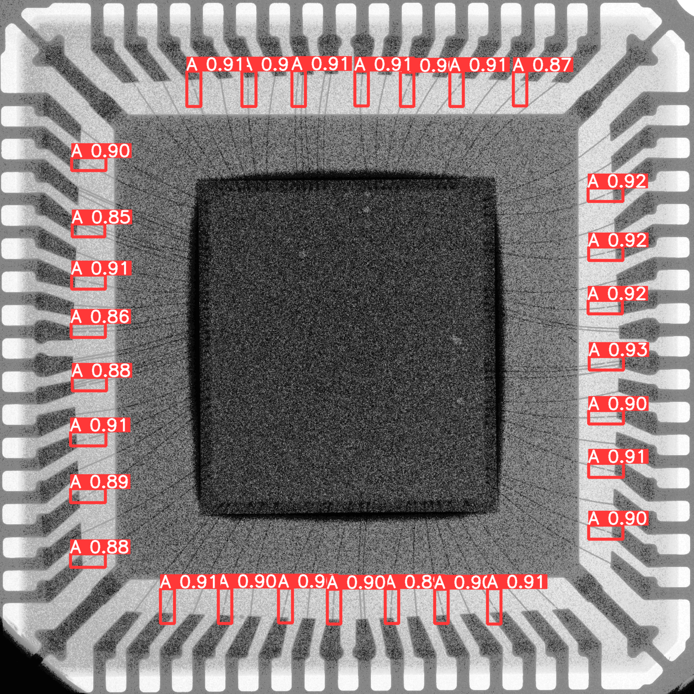
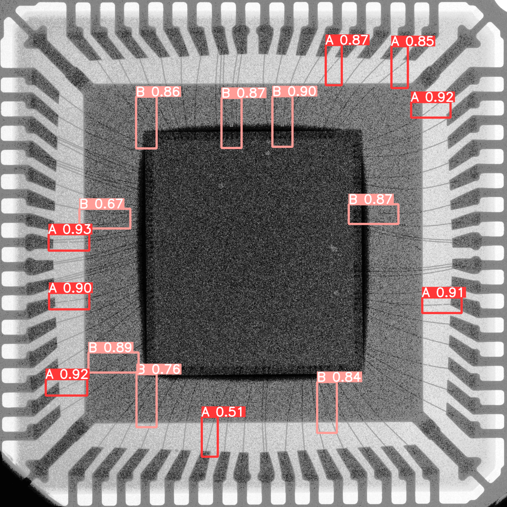

# YOLO_dataset_preprocess  

## build requirement  
Python requirement: pip install -r requirement.txt

## files statement
### parity* files: to generate the dataset in which the labels are chosen according to parity  
Firstly, the labels are chosen from the concentric lebel dataset, and the according label groups are generated in txt file with suffix _0 and _1 to distinguish odd and even. In this part, one can change the parameters w_l and h_l to control the w and h of the label box.

Secondly, the images are modified according to the labels chosen, where the label positions are replaced with patches of background pixels. One can change the parameters w_g and h_b to control the size of the patches.

Thirdly, the images and labels are split according to the prefix id of the file, getting the YOLO format dataset.
Run parity_dataset_gen.py to run the above steps sequentially.

   
  <em>Demo for parity chosen labels</em>

### random* files: to generate the dataset in which the labels are chosen according to parity  
Firstly, the labels are chosen randomly from the concentric lebel dataset, and the according label groups are generated in txt file with same prefix and different suffix, meaning same id but different batches. In this part, one can change the parameters w_l and h_l to control the w and h of the label box. Also, the number of bright and gray boxes, distance between boxes, and number of batches of label groups can be modified. 

Secondly, the images are modified according to the labels chosen, where the label positions are replaced with patches of background pixels. One can change the parameters w_g and h_b to control the size of the patches.

Thirdly, the images and labels are split according to the prefix id of the file, getting the YOLO format dataset.
Run random_dataset_gen.py to run the above steps sequentially.

   
  <em>Demo for random chosen labels</em>

## prarametizing  
Change the parameters in tools/parameter.py.

## verify image labeling  
run in terminal:  
labelImg  
see tutorial in https://github.com/HumanSignal/labelImg  

## Future Work  
YOLO training with the dataset generated.

## git maintanance
### Fetch code  
git pull  

### Update git (change the lab to your name)  
git add .  
git commit -m "Jerry"  
git push